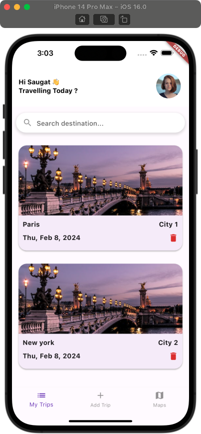
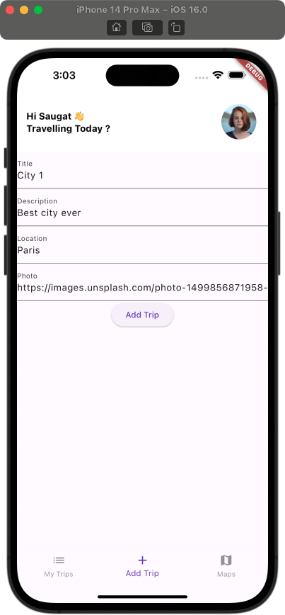

# travel_app

Travel app using Riverpod.

## Getting Started

This project is a starting point for developers who want to learn about riverpod state management and clean architecture for a Flutter application.

This project includes:
* Clean architecture
* Riverpod state management
* Hive local storage datasource
* Bottom nav example

